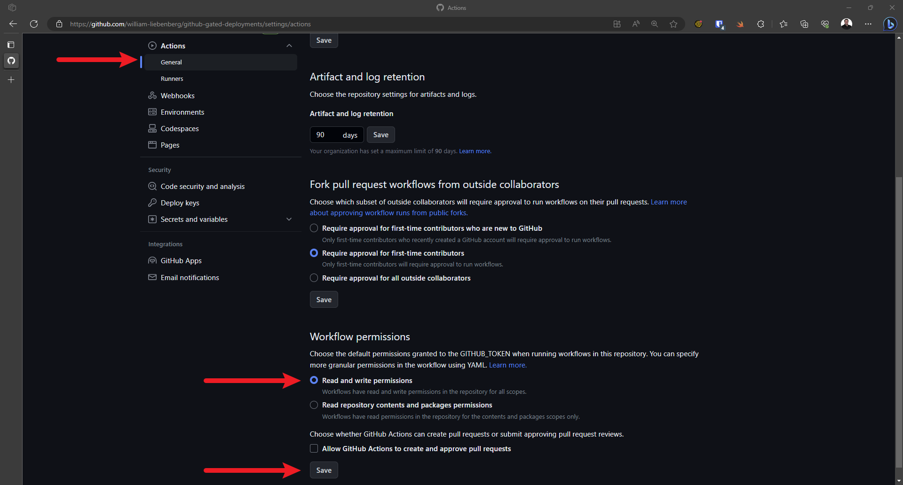
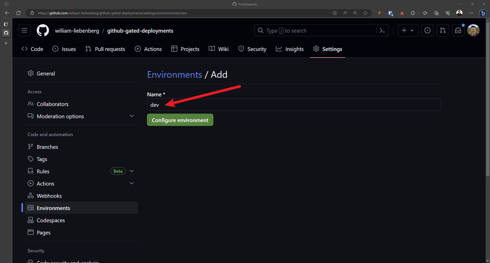
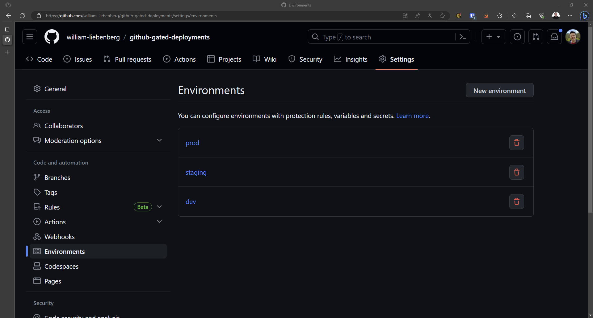

# How to set up manual approvals with Github Environments

This repo shows how to set up GitHub approval gates that will require a user to [review and approve](https://docs.github.com/en/actions/managing-workflow-runs/reviewing-deployments) the changes before they are deployed to an individual [environment](https://docs.github.com/en/actions/deployment/targeting-different-environments/using-environments-for-deployment).

Figure: Enable workflow write permissions

## Add new Environment and Required Reviewers

To add a new Environment:

1. Go to **Settings | Environments**
2. Select **New environment**

Figure: No environments (yet)

3. Give the environment a name (e.g. dev, staging, prod)
4. Select **Configure environment**

Figure: Creating new environment

5. Check **Require reviewers**
6. Add one or more required reviewers by searching for their names

 
Figure: Adding required reviewers

7. Prevent Admin users from misbehaving - don't allow them to bypass the protection rules in this environment

Figure: Prevent Admins from doing dodgy things!

1. Select **Save protection rules**
2. Repeat for other environments

Figure: All configured environments

## Example workflow

Here is a high-level workflow for building and deploying a project:

1. In Parallel:
   - Build the .NET WebAPI application
   - Build the UI application
   - Run Unit Test
2. Automatically deploy the applications to `dev`
3. After review and manual approval by Release Master, deploy the applications to `staging`
4. After review and manual approval by Release Master, deploy the applications to `prod`

Once the workflow is triggered (by push, pr, schedule or dispatch), it will run until a manual approval is required.

Figure: Waiting for manual approval to deploy to Staging

Once the reviewer has approved, the workflow will continue until it reaches another approval or reaches the end of the workflow.

Figure: Manually approving a review before deploying to next environment

Now you know how to set up manual approval gates using GitHub Environments.

DONE!